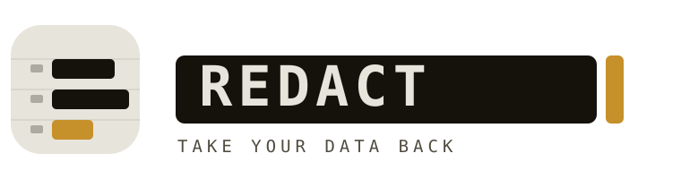

<p align="center">
  
</p>

<p align="center">
  <b><a href="https://davidfliesen.github.io/redact/">→ Open Redact</a></b><br>
  <sub>Free. Nothing to install. Your info stays on your device.</sub>
</p>

---

## What is this?

Companies called **data brokers** quietly collect your name, address, phone
number, and email, then post them on "people search" websites for anyone to
look up. It's how strangers, spammers, and scammers find you.

**Redact helps you take that back.** It's a free web app that finds where
you're listed and helps you get removed — think of it like a virus scan for
your personal information: it looks, shows you what it found, and cleans it up.

There's no sign-up, no subscription, and nothing to download. It works right
in your web browser, on your phone or computer.

## How to use it — three steps

1. **Enter your info.** Type in your name and where you live. This is saved
   *only on your own device* so you don't have to type it again.
2. **Scan.** Redact checks the big broker sites and shows you, in plain sight,
   which ones are posting your details.
3. **Clean.** With one tap it sends removal requests. A few brokers ask you to
   click a confirmation link they email you — Redact tells you exactly which
   ones and hands you the link.

Prefer to go slowly and do it yourself? Every broker also has a **guided card**
with a ready-to-send request, so you're never stuck.

> On a phone, you can also tap your browser's **"Add to Home Screen"** to keep
> Redact one tap away, like any other app.

## What happens to my information?

This is the whole point, so here it is straight:

- **On your device.** Everything you type is stored **only in your browser.**
  There's no account and no database with your name in it. Clear your browser
  and it's gone.
- **Only when you press a button.** The one moment your details leave your
  device is when *you* tap **Scan** or **Clean** — they're sent to Redact's
  scanning helper **for that job only**, used to find and remove your listings,
  and then discarded. They are never sold, shared, or kept.
- **Out in the open.** Redact is open source. Anyone can read exactly what it
  does — there are no hidden pieces. See the plain-English writeup in
  [`docs/how-it-works.md`](docs/how-it-works.md).

## Is it really free?

Yes. The paid services you may have seen (the ones that charge every month) do
essentially the same thing behind a subscription. Redact is given away. It runs
on a free-tier server, so please be patient if a scan takes a minute.

## A few honest notes

- **Brokers add you back.** Removal isn't always forever — some brokers
  re-list people over time. If that happens, just run Redact again. Nothing
  runs in the background or on a timer; it only ever works when you ask it to.
- **Some steps need you.** When a broker requires a code from your email or a
  quick phone verification, that part has to be you — no tool can (or should)
  fake it. Redact points you right to it.
- **California residents** have a shortcut: the state's
  [DROP platform](https://privacy.ca.gov/) can delete you from every registered
  broker with a single request. Redact links you to it.

This tool helps you use privacy rights you already have. It isn't legal advice.

---

<details>
<summary><b>Under the hood</b> (for the curious or technical)</summary>

Redact is two simple parts:

- **The app** (this repo, served by GitHub Pages) — a plain HTML/CSS/JS
  progressive web app. No framework, no tracking, no cookies. Your details live
  in `localStorage`.
- **The engine** ([`/server`](server/)) — a small FastAPI service that does the
  scanning and submitting with a headless browser. It's designed to run on an
  Oracle Cloud "Always Free" server. Setup lives in
  [`server/README.md`](server/README.md).

The app talks to the engine only when someone presses Scan or Clean, and only
for the length of that job. Turn the engine off (leave `REDACT_API_BASE` blank
in `assets/js/config.js`) and the app still works in guided mode.

```
redact/
├── index.html            the app
├── assets/               css · js · brand · icons
├── data/brokers.json     the guided-removal catalog (editable)
├── docs/how-it-works.md  plain-English explainer
└── server/               the scanning engine + deploy guide
```

Built by [David Fliesen](https://davidfliesen.github.io) / Cibola Studios.
</details>
